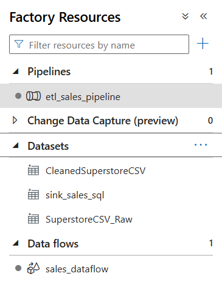
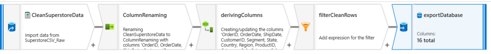
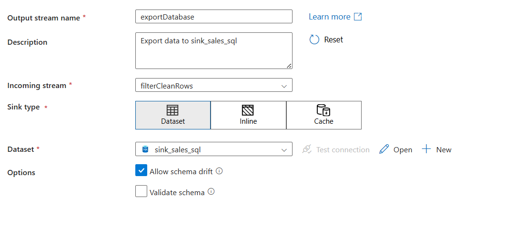
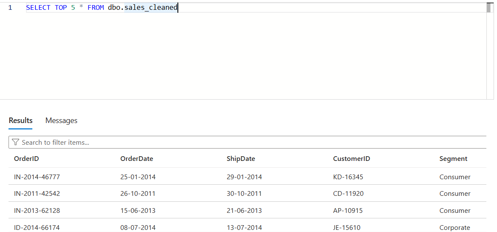
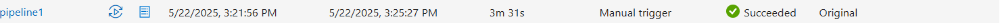

Azure Data Factory pipeline that loads cleaned sales data into Azure SQL Database.
# 🚀 Azure Data Factory Sales ETL Pipeline

This project showcases a complete end-to-end ETL pipeline using **Azure Data Factory (ADF)** to ingest, clean, and load raw sales data into an **Azure SQL Database**.

---

## 📌 Project Summary

This is a real-world-style Azure Data Engineering workflow with:

- **Source**: Superstore sales CSV in Azure Blob Storage
- **Dataflow**: Rename columns, derive new fields, filter nulls
- **Sink**: Azure SQL Database (`dbo.sales_cleaned`)
- **Tools Used**: ADF, Azure SQL, Azure Blob, Query Editor

---

## 🧱 Architecture Overview

| ADF Overview | Data Flow | Sink Config |
|--------------|-----------|-------------|
|  |  |  |

---

## 📊 Data Output (SQL Query Result)

| Query Success |
|---------------|
|  |

---

## ✅ Pipeline Execution

| Monitor Tab |
|-------------|
|  |

---

## 🧾 Example Queries

View full query file: [`sql/example_queries.sql`](sql/example_queries.sql)

```sql
-- View sample data
SELECT TOP 10 * FROM dbo.sales_cleaned;

-- Total orders by segment
SELECT Segment, COUNT(*) AS SegmentOrders
FROM dbo.sales_cleaned
GROUP BY Segment;

-- Total sales by country
SELECT Country, SUM(Sales) AS TotalSales
FROM dbo.sales_cleaned
GROUP BY Country;
